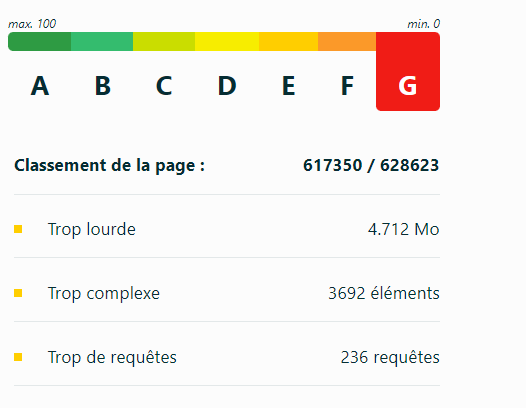

Déclaration environnementale de ce site web
Mesure effectuée le Mon Sep 29 2025.

Niveau d’écoconception du site web

 
 Pour 10000 visites par mois, l’empreinte de cette page est de :
-42.9 | Consommation d’eau bleue
-2.86 KgCO2e

Ça veut dire quoi ?

Pour vous donner une idée, 1 kg CO2e équivaut à un trajet d’environ 5 km en voiture. Une douche consomme en moyenne 6 litres d’eau à la minute.

Si votre page émet 1,7g CO2e et consomme 2,5cl d’eau, cela signifie que pour 1000 visiteurs mensuels, l’empreinte est de 1,7kg de CO2e et 25 litres d’eau par mois – soit un trajet de 5,5km en voiture et une douche de 4 minutes.

Méthode d'évaluation
Comme toute production numérique, ce site web a un impact environnemental que nous vous présentons sur cette page à l’aide d’indicateurs standardisés.

Nous utilisons le référentiel EcoIndex proposé par le collectif GreenIT.fr, pour évaluer la performance environnementale de ce site web. Celui-ci est quantifié grâce à deux types d'indicateurs :

Niveau d’écoconception du site web. Cet indicateur évalue la mise en place de bonnes pratiques permettant de réduire l'impact d'une page web. Le niveau atteint est représenté par une évaluation relative de A à G (A est la meilleure note) associée à un score absolu de 0 à 100 (100 est la meilleure note).
Consommation d'eau et émission de GES liées au chargement de la page. Cet indicateur quantifie la consommation d'eau douce (cls) et l'émission de GES (gCO2e) liées au chargement d'une page web.
À des fins de synthèse, quatre types de données sont représentées :

Niveau d'écoconception pour les 5 pages les plus visitées du site web
Niveau d'écoconception pour 5 parcours utilisateurs type du site web
Consommation d'eau (exprimée en litres) et émission de GES (kilos CO2e) liée au chargement d'une page web pour 1 utilisateur, et rapportée à 1 000 utilisateurs.
Consommation d'eau (exprimée en litres) et émission de GES (kilos CO2e) liée à l'exécution d'un parcours pour 1 utilisateur, et rapportée à 1 000 utilisateurs.